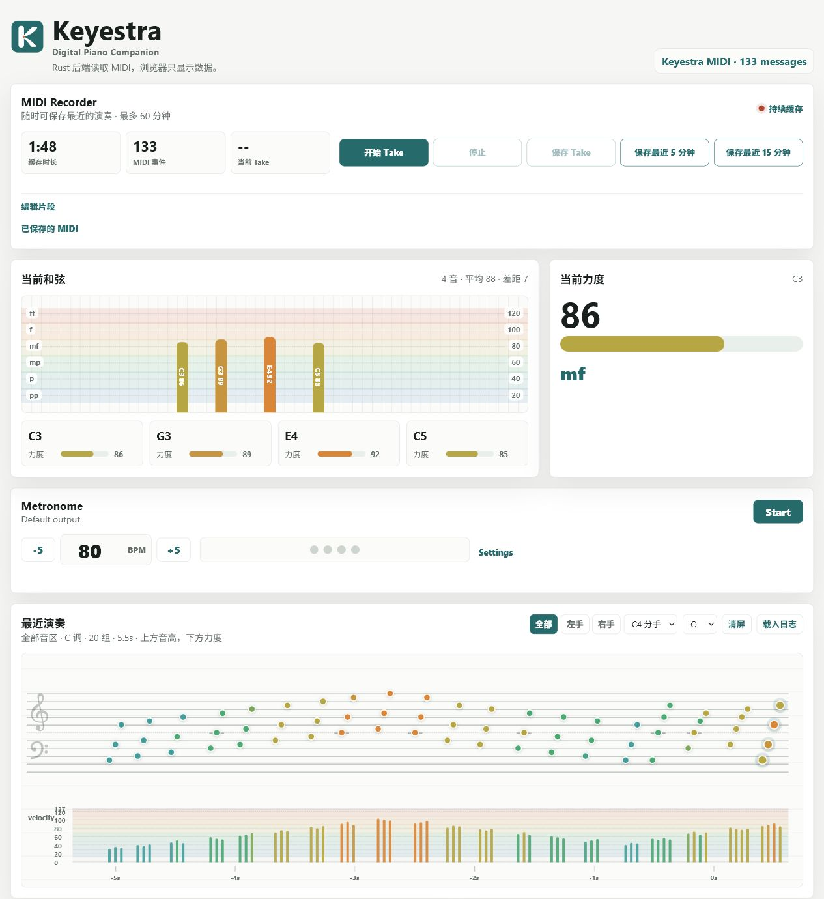
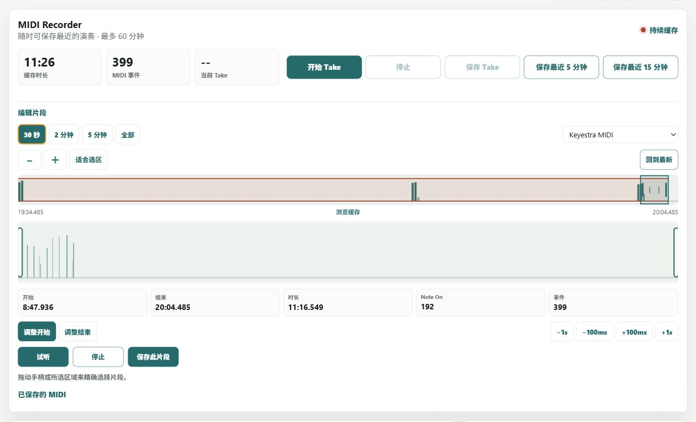

<p align="center">
  
</p>

<h1 align="center">Keyestra</h1>

<p align="center">
  <strong>Digital Piano Companion</strong><br>
  Expressive velocity shaping, resilient MIDI routing, performance insight,
  a metronome, and a rolling recorder.
</p>

Keyestra sits between a digital piano and the software instrument or DAW you
already use. It makes the keyboard's velocity response more expressive while
preserving the rest of the MIDI performance, then turns the mapped stream into
useful live feedback and recoverable recordings.

```text
Digital piano
      │
      ▼
Keyestra mapper ──► Keyestra MIDI ──► Pianoteq / Reaper / another instrument
                           │
                           └────────► Monitor + rolling MIDI recorder
```

> Keyestra does not create virtual MIDI ports. On Windows, create a loopMIDI
> port named `Keyestra MIDI` before starting it. On macOS, use an IAC Driver
> port or another existing virtual MIDI port.

## Monitor



The screenshot is from the real Monitor UI. Its sample performance was sent
through the normal MIDI input and recorder pipeline with:

```powershell
cargo run --example send_demo_midi
```

The demo plays a short chord progression across `pp`–`ff`, including sustain,
so documentation screenshots and manual UI checks are repeatable without a
physical piano.

## Highlights

- **Expressive velocity mapping** — piecewise curves or an exact 128-value
  table reshape only Note On velocities from `1..=127`.
- **MIDI-safe routing** — Note Off, Note On velocity `0`, sustain, CC, pitch
  bend, program changes, channel pressure, SysEx, and unknown messages pass
  through unchanged.
- **Resilient Windows Tray** — waits for missing ports, reconnects when devices
  return, supervises the mapper, and remembers the selected curve.
- **Live performance insight** — shows chords, note velocities, dynamic bands,
  keyboard range, staff history, raw MIDI, and left/right-hand filtering.
- **Rolling recorder** — keeps the latest 60 minutes in memory, supports Takes
  and recent-range saves, offers precise clip selection and preview, and
  exports standard MIDI files.
- **Built-in metronome** — controllable from the desktop or mobile Monitor
  layout without changing the mapped MIDI stream.
- **Traceable releases** — the Monitor footer, `/version`, deployed directory,
  and release metadata share the same package version and Git build ID.

## Quick Start

### 1. Prepare the virtual port

Create a virtual MIDI port named:

```text
Keyestra MIDI
```

The runtime also recognizes the legacy `FP10 Mapped` name as a migration
fallback.

### 2. List available ports

```powershell
cargo run -- --list
```

Port selectors accept either an index or a case-insensitive name substring.

### 3. Run the mapper

```powershell
cargo run -- `
  --in "Roland FP-10" `
  --out "Keyestra MIDI" `
  --curve examples/curve.toml
```

Useful alternatives:

```powershell
# Print mapped note activity in the terminal
cargo run -- --in "Roland FP-10" --out "Keyestra MIDI" `
  --curve examples/curve.toml --monitor

# Route MIDI without velocity mapping
cargo run -- --in "Roland FP-10" --out "Keyestra MIDI" --bypass
```

In Reaper or another DAW, enable the mapped `Keyestra MIDI` input. Disable the
raw piano input for that track or each note may arrive twice.

## Windows Tray App

Build all three applications:

```powershell
cargo build --release `
  --bin keyestra `
  --bin keyestra-tray `
  --bin keyestra-monitor
```

For local development, start:

```powershell
.\target\release\keyestra-tray.exe
```

The Tray starts the mapper and Monitor with these defaults:

```text
input:   Roland Digital Piano
output:  Keyestra MIDI
curve:   examples/curve.toml
monitor: http://localhost:8770
```

Right-click the Tray icon to inspect status, start or stop mapping, restart,
switch between the built-in curves, open the Monitor, manage Windows Startup,
or exit.

If a MIDI port is missing at login, the Tray stays available in **Waiting**
state. It starts mapping when both ports appear, returns to standby if either
disappears, and reconnects automatically. Unexpected mapper exits use
exponential retry delays from 5 to 60 seconds; a stable 30-second run resets
the delay.

## Monitor and Recorder

The Monitor is served locally by `keyestra-monitor` and works in desktop and
mobile browsers. It provides:

- current chord and per-note velocity;
- practical `pp`, `p`, `mp`, `mf`, `f`, and `ff` working ranges;
- staff and velocity-lane performance history;
- raw MIDI inspection and voice/range filtering;
- a browser-controlled metronome;
- a phone-first rhythm practice mode with one-bar count-in, 2/3/4 notes per
  beat, early/late timing feedback, automatic round summaries, and
  start/pause/resume/finish controls;
- a 60-minute rolling MIDI buffer;
- Take, latest-5-minute, and latest-15-minute saves;
- a detailed timeline with pan, zoom, overview, range handles, preview, and
  standard MIDI export;
- downloads for the 20 most recently saved recordings.

### Rhythm practice

On a phone-width Monitor, **节奏练习** appears above the regular metronome. Set
the BPM, choose 2, 3, or 4 notes per beat, choose the number of four-beat
rounds, and start from the phone. The first bar is a count-in and is not scored.

Each Note On or chord onset is matched to the nearest metronome subdivision.
The live view shows whether the recent attacks are early or late, their median
offset, timing spread, hit rate, and missed/extra attacks. Completed bars are
summarized automatically. Pausing preserves completed work and gives another
one-bar count-in when resumed.

Timing analysis runs in the monitor backend using the MIDI callback and the
metronome audio clock. The phone sends controls and renders results; browser
network timing is not used for scoring. Chord notes arriving within 52 ms count
as one attack, and every MIDI message still follows the normal recording and
monitor pipeline.

### Rolling capture and clip export



The Recorder continuously buffers mapped MIDI without requiring a recording
button. You can mark a Take, save the latest 5 or 15 minutes immediately, or
expand **编辑片段** for a precise export:

- switch the detailed view between 30 seconds, 2 minutes, 5 minutes, or the
  complete buffer;
- use the overview to locate activity, then pan and zoom the detailed timeline;
- drag the selection or its start/end handles and nudge either boundary by
  `100 ms` or `1 s`;
- preview the selected range through a chosen MIDI output;
- save exactly that range as a standard `.mid` file.

Recordings are written atomically to:

```text
%APPDATA%\keyestra\recordings
```

The recorder retains Note On, Note Off, sustain and other CC messages, pitch
bend, program changes, channel pressure, and SysEx. MIDI clock, active sensing,
and other system real-time messages are intentionally omitted from the rolling
buffer.

Exports use a fixed high-resolution timing scale without quantizing the
performance. Sustain-off and all-notes-off messages are appended for every
used channel to prevent stuck notes during playback.

The rolling buffer is currently memory-backed. Restarting the Monitor clears
unsaved material; saved `.mid` files remain on disk. Preview pauses rolling
capture so playback returning through the virtual port cannot contaminate the
buffer.

The detailed editor and API design is documented in
[`docs/RECORDER_PREVIEW_DESIGN.md`](docs/RECORDER_PREVIEW_DESIGN.md).

## Velocity Curves

The default FP-10 curve is [`examples/curve.toml`](examples/curve.toml):

```toml
[input]
name = "Roland FP-10"

[output]
name = "Keyestra MIDI"

[mapping]
mode = "piecewise"
points = [
  [0, 0],
  [1, 0],
  [18, 30],
  [32, 57],
  [50, 84],
  [108, 127],
  [127, 127],
]
```

Each point is `[input_velocity, output_velocity]`. Keyestra interpolates a
128-value lookup table at startup. Velocity `0` is always forced to `0`.

[`examples/curve-mid-control.toml`](examples/curve-mid-control.toml) is a more
conservative option with extra finger-control room around velocities `50–80`.
The Tray can switch between both built-in curves and restarts the mapper
automatically.

Table mode accepts exactly 128 output values, indexed by input velocity. See
[`examples/table.toml`](examples/table.toml) for a complete configuration.

### Dynamic bands

| Dynamic | Center | Working range |
| --- | ---: | ---: |
| `pp` | 20 | 12–30 |
| `p` | 40 | 28–50 |
| `mp` | 60 | 48–70 |
| `mf` | 80 | 68–90 |
| `f` | 100 | 88–110 |
| `ff` | 120 | 108–127 |

Neighboring ranges overlap, so boundary values can appear as transitions such
as `p/mp` instead of flickering between hard labels.

## Windows Deployment

`target\release` is Cargo output, not an installation directory. Deploy an
immutable current-user release with:

```powershell
powershell.exe -NoProfile -ExecutionPolicy Bypass `
  -File .\scripts\deploy-windows.ps1
```

The script runs formatting and tests, builds all three binaries, publishes
them under:

```text
%LOCALAPPDATA%\keyestra\releases\<version>-<build>\
```

It also writes `%LOCALAPPDATA%\keyestra\current.json` and updates:

```text
%APPDATA%\Microsoft\Windows\Start Menu\Programs\Startup\keyestra-tray.vbs
```

Normal deployment does not stop the running release and therefore preserves
the unsaved recorder buffer. The new release starts at the next login or after
the current Tray exits.

To deploy and switch immediately:

```powershell
powershell.exe -NoProfile -ExecutionPolicy Bypass `
  -File .\scripts\deploy-windows.ps1 -Activate
```

> **Activation stops Keyestra and legacy FP10 processes and permanently
> discards the unsaved in-memory recorder buffer.**

Release identity makes the source state explicit:

```text
clean commit:         0.2.0-d137d292
uncommitted preview:  0.2.0-d137d292-dirty-20260728T231500Z
Git ID unavailable:   0.2.0-snapshot-20260728T231500Z
```

The same identity is embedded in the binaries, stored in `current.json`,
returned by `GET /version`, shown in the Monitor footer, and used for the
immutable release directory.

### Startup rollback and removal

Point Startup to an earlier installed release without stopping the current
one:

```powershell
& "$env:LOCALAPPDATA\keyestra\releases\<old-release>\keyestra-tray.exe" `
  --install-startup
```

Remove current-user Startup:

```powershell
& "$env:LOCALAPPDATA\keyestra\releases\<release>\keyestra-tray.exe" `
  --uninstall-startup
```

Tray logs are stored at `%APPDATA%\keyestra\tray.log`, capped at 5 MB, with one
rotated backup at `tray.log.1`.

## Migration from fp10-map

On first launch, Keyestra copies legacy settings and saved `.mid` recordings
from `%APPDATA%\fp10-map` into `%APPDATA%\keyestra`. Source files are retained
as a backup.

Installing Keyestra Startup writes `keyestra-tray.vbs` and removes the legacy
`fp10-map-tray.vbs` only after the new entry has been written successfully.
Built-in curve selections are migrated to the current deployed release, while
explicit custom curve paths remain unchanged.

## Development

For normal changes:

```powershell
cargo fmt --check
cargo test
```

For changes affecting the Tray, Monitor server, binary identity, or packaging:

```powershell
cargo build --release `
  --bin keyestra `
  --bin keyestra-tray `
  --bin keyestra-monitor
```

Regenerate icon assets with:

```powershell
python .\scripts\generate-icons.py
```

Brand assets live in [`assets/icons`](assets/icons), including SVG masters,
transparent PNGs, the runtime Tray RGBA payload, and the multi-resolution
Windows `.ico`.

## Current Scope

Keyestra already supports MIDI port discovery, name/index selection, velocity
curves and tables, bypass and terminal-monitor modes, supervised reconnecting
Tray operation, desktop/mobile performance monitoring, metronome control, and
rolling MIDI recording with range preview and export.

Useful future work includes a visual curve editor, crash-recoverable rolling
recording journal, richer practice analytics, and platform-native Tray support
beyond Windows.
