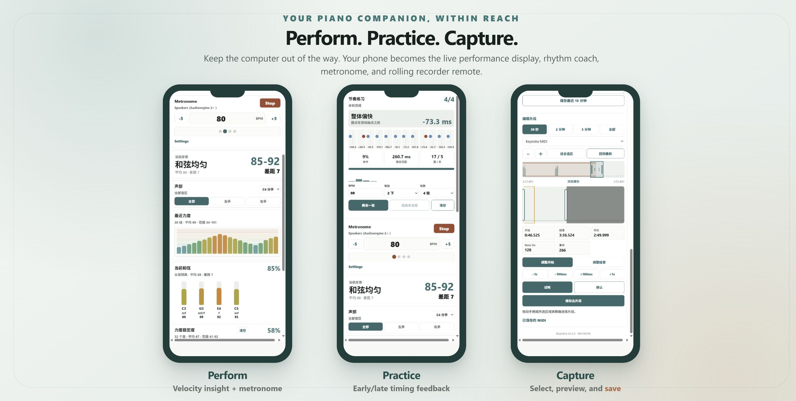
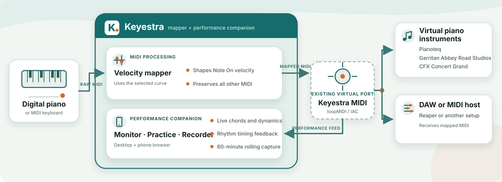

<p align="center">
  
</p>

<h1 align="center">Keyestra</h1>

<p align="center">
  <a href="README.md">English</a> · 简体中文
</p>

<p align="center">
  <strong>数码钢琴演奏助手</strong><br>
  调整钢琴的力度响应，了解自己的演奏，并通过电脑或手机保存演奏。
</p>

Keyestra 位于数码钢琴与软音源或 DAW 之间。它只重新映射 Note On
力度，同时完整保留踏板、弯音和其他 MIDI 信息，并利用映射后的演奏
提供实时反馈、节奏练习和可恢复的滚动录音。



## 为什么使用 Keyestra？

数码钢琴与软件音源对触键力度的响应经常并不匹配。Keyestra 可以通过
可配置的力度曲线改善演奏手感，同时不影响 Note Off、延音踏板、CC、
弯音和其他 MIDI 消息。



Keyestra 同时包含 MIDI 映射器和基于浏览器的演奏助手。已有的虚拟 MIDI
端口会把映射后的演奏发送到软音源或 DAW，并送回 Keyestra Monitor、
节奏练习和滚动录音器。

Keyestra 本身不会创建虚拟 MIDI 端口。在 Windows 上请创建名为
`Keyestra MIDI` 的 loopMIDI 端口；在 macOS 上可使用 IAC Driver 或其他
已有的虚拟 MIDI 端口。

## 主要功能

- **力度曲线调整** — 使用分段曲线或精确的 128 项映射表，让键盘更好地
  匹配常用软音源。
- **安全的 MIDI 路由** — Note Off、延音踏板、CC、弯音、Program Change、
  Channel Pressure、SysEx 和未知消息均原样通过。
- **手机遥控** — 查看力度与和弦、控制节拍器、进行节奏练习和管理录音。
- **滚动录音** — 找回最近的演奏、标记 Take、精确选择和试听片段，并导出
  标准 MIDI 文件。
- **一键 CFX 渲染** — 使用自己的 REAPER 与 Garritan CFX 模板，把保存的
  MIDI 自动生成便于分享的 MP3 或无损 WAV；响度标准化、True Peak 上限和
  输出质量均由模板控制。
- **可靠的 Windows 托盘程序** — 等待暂时缺失的设备、自动重连、监控映射器，
  并记住所选力度曲线。

## 系统要求

完整的托盘和部署流程目前主要面向 Windows。从源码运行 Keyestra 需要：

- 数码钢琴或 MIDI 键盘；
- loopMIDI 等虚拟 MIDI 端口；
- 能接收映射后 MIDI 的软音源或 DAW；
- 安装了 `cargo` 的 Rust 工具链。

如果需要用手机访问，请让手机和电脑连接到同一个可信任的局域网。

## 从源码快速开始

### 1. 创建虚拟端口

创建名为以下内容的虚拟 MIDI 端口：

```text
Keyestra MIDI
```

### 2. 查看 MIDI 端口名称

```powershell
cargo run -- --list
```

端口选择支持数字序号或不区分大小写的名称片段。

### 3. 构建并启动 Windows 托盘程序

```powershell
cargo build --release `
  --bin keyestra `
  --bin keyestra-tray `
  --bin keyestra-monitor

.\target\release\keyestra-tray.exe --in "Roland FP-10"
```

请把 `Roland FP-10` 替换为钢琴 MIDI 输入名称中具有辨识度的部分。托盘程序
默认使用 `Keyestra MIDI` 作为映射输出和 Monitor 输入。

以上方式适合从 Cargo 输出目录试用。若要安装到当前 Windows 用户并配置
开机启动，请参阅 [`docs/DEPLOYMENT.md`](docs/DEPLOYMENT.md)。

### 4. 连接软音源或 DAW

在 Pianoteq、REAPER 或其他软音源中启用映射后的 `Keyestra MIDI` 输入，并在
该轨道关闭钢琴的原始输入，否则每个音符可能会触发两次。

电脑上的 Monitor 地址为：

```text
http://localhost:8770
```

## 使用手机遥控

让手机与电脑连接到同一局域网，然后打开：

```text
http://<电脑 IP>:8770
```

可在 Windows 中使用 `ipconfig` 查找电脑的 IPv4 地址，不需要安装手机 App。
如果 Windows 询问网络权限，请只在可信任的专用网络中允许 Keyestra。

手机界面围绕三项主要任务组织：

- **演奏** — 查看当前和弦、每个音符的力度、动态范围、演奏历史和节拍器。
- **练习** — 设置速度、每拍音符数和轮数，获得即时早晚反馈与每轮总结。
- **录音** — 标记 Take、保存最近一段演奏，或精确选择并试听片段后导出。

## 托盘程序的日常使用

右键单击托盘图标可以：

- 查看映射器和 Monitor 状态；
- 启动、停止或重启映射；
- 切换内置力度曲线；
- 打开 Monitor；
- 管理 Windows 开机启动；
- 退出 Keyestra。

如果所需 MIDI 端口暂时不存在，托盘会保持 **Waiting** 状态，并在设备恢复后
自动开始映射。

默认设置如下：

```text
input:   Roland Digital Piano
output:  Keyestra MIDI
curve:   examples/curve.toml
monitor: http://localhost:8770
```

## 节奏练习

在手机宽度的 Monitor 中，**节奏练习**显示在普通节拍器上方。设置 BPM，选择
每拍 2、3 或 4 个音符，选择四拍一轮的轮数，然后开始练习。

第一小节是不会计分的预备拍。练习期间 Monitor 会显示：

- 最近触键偏早还是偏晚；
- 时间偏差中位数和分散程度；
- 命中率、漏弹和多弹；
- 每轮完成后的总结。

暂停会保留已完成内容，继续时会重新播放一小节预备拍。

## 录音与片段导出


录音器会持续在内存中保留最近 60 分钟的映射后 MIDI。你可以：

- 标记并保存一个 Take；
- 立即保存最近 5 或 15 分钟；
- 查看 30 秒、2 分钟、5 分钟或完整缓冲区；
- 平移和缩放时间线；
- 拖动或微调选择边界；
- 通过 MIDI 输出试听所选片段；
- 将所选片段保存为标准 `.mid` 文件。

保存的录音位于：

```text
%APPDATA%\keyestra\recordings
```

> 滚动缓冲仅存在于内存中。重启 Monitor 会永久清除尚未保存的内容；已经保存
> 的 `.mid` 文件不会受到影响。

试听期间会暂时停止滚动录音，避免返回虚拟端口的播放内容被再次录入。

### 使用 REAPER 和 Garritan CFX 渲染 MIDI

在 Windows 上，每条已保存 MIDI 都可以通过本地 REAPER 项目模板生成便于日常
试听和分享的 MP3，或用于保存与后期处理的无损 WAV。Keyestra 默认查找：

```text
%APPDATA%\REAPER\ProjectTemplates\Keyestra CFX Render.rpp
%APPDATA%\REAPER\ProjectTemplates\Keyestra CFX Render MP3.rpp
```

模板必须包含一条名为 `CFX Render` 的轨道，并在其中加载 CFX Concert Grand
VSTi。输出格式、编码质量、响度标准化、True Peak 上限和尾音时长均由各自模板
中保存的 REAPER Render 设置决定。

推荐的日常 MP3 模板可使用 48 kHz stereo、320 kbps、−18 LUFS-I 和 −1 dBTP；
WAV 模板则适合无损存档和后续编辑。若需要改变响度或尾音长度，只需更新并重新
保存相应模板，Keyestra 不需要改代码。

在已保存 MIDI 旁点击 **生成 MP3** 或 **生成 WAV** 即可加入后台队列。渲染期间
Monitor 和滚动录音器仍可使用。完成的文件会与 MIDI 保存在同一目录：

```text
原文件名_natural.mp3
原文件名_natural.wav
```

Keyestra 不会覆盖源 MIDI，也不会修改可重复使用的 REAPER 模板。默认 REAPER
路径为 `C:\Program Files\REAPER (x64)\reaper.exe`。如果使用便携版 REAPER 或
不同名称的模板，可通过 [`docs/CLI.md`](docs/CLI.md) 中的 Monitor 参数覆盖路径。

## 力度曲线

默认曲线位于 [`examples/curve.toml`](examples/curve.toml)：

```toml
[input]
name = "Roland Digital Piano"

[output]
name = "Keyestra MIDI"

[mapping]
mode = "piecewise"
points = [
  [0, 0],
  [1, 0],
  [18, 30],
  [32, 57],
  [50, 84],
  [108, 127],
  [127, 127],
]
```

每个点表示 `[输入力度, 输出力度]`。Keyestra 启动时会将这些点插值成力度查找表。
力度 `0` 始终保持为 `0`，因为 Note On velocity `0` 通常表示 Note Off。

[`examples/curve-mid-control.toml`](examples/curve-mid-control.toml) 在中等力度区域保留
更多手指控制空间。托盘程序可以在两个内置曲线之间切换；精确表格模式示例位于
[`examples/table.toml`](examples/table.toml)。

## 高级命令行用法

映射器和 Monitor 可以脱离托盘程序单独运行。端口发现、直接路由、Bypass、终端
监控和 Monitor 地址设置请参阅 [`docs/CLI.md`](docs/CLI.md)。

## 常见问题

| 问题 | 检查内容 |
| --- | --- |
| 托盘显示 **Waiting** | 确认钢琴和 `Keyestra MIDI` 端口存在，并检查配置名称是否匹配。 |
| 每个音符响两次 | 在软音源或 DAW 中关闭钢琴原始输入，只监听 `Keyestra MIDI`。 |
| 手机无法打开 Monitor | 确认两台设备处于同一网络，使用电脑 IPv4 地址，并允许专用网络访问。 |
| 节拍器没有声音 | 打开 Monitor 的 **Settings**，选择正确的音频输出。 |
| 未保存的演奏消失 | 重启 Monitor 会清除内存滚动缓冲；已保存 MIDI 仍在录音目录。 |
| MP3/WAV 按钮不可用 | 确认 REAPER、对应项目模板和 CFX 插件均已安装，且模板轨道名为 `CFX Render`。 |

## 文档

- [English README](README.md)
- [Windows 部署与回滚](docs/DEPLOYMENT.md)
- [命令行用法](docs/CLI.md)
- [录音器与片段编辑器设计](docs/RECORDER_PREVIEW_DESIGN.md)
- [演示数据和截图流程](demo/README.md)
- [贡献与验证](CONTRIBUTING.md)
